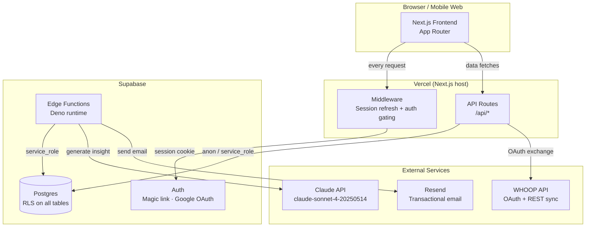
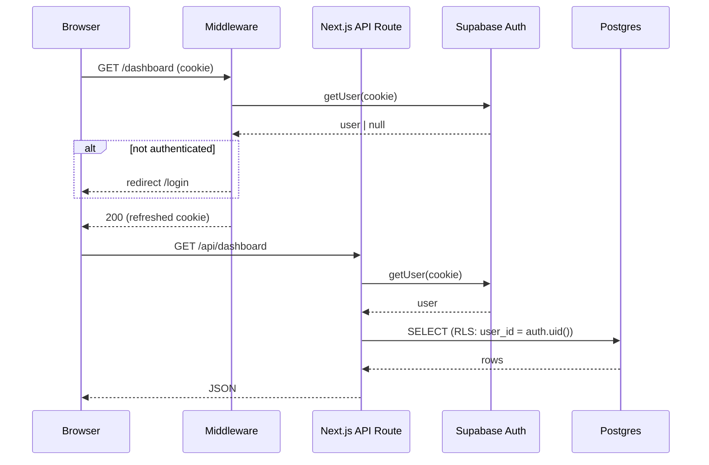
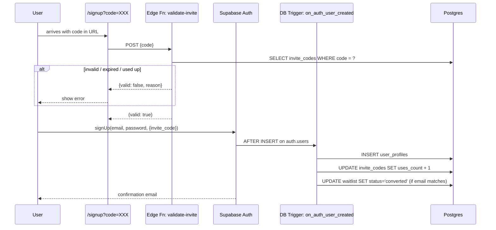
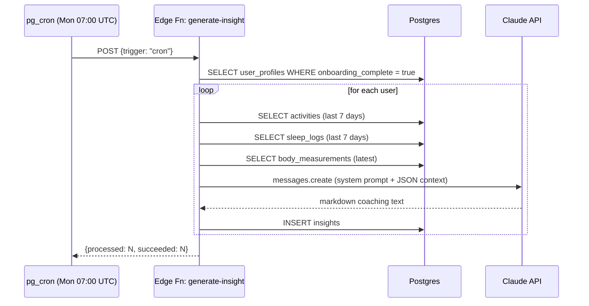

# Movu — System Architecture

## High-level overview



---

## Request flow — authenticated page



---

## Invite code + signup flow



---

## Weekly coaching insight generation



---

## Database schema

```mermaid
erDiagram
    auth_users {
        uuid id PK
        text email
    }

    invite_codes {
        uuid id PK
        text code UK
        uuid created_by FK
        int max_uses
        int uses_count
        timestamptz expires_at
        boolean active
        text note
    }

    waitlist {
        uuid id PK
        text email UK
        text name
        text city
        text goal
        text referred_by FK
        int position
        text status
        timestamptz invited_at
    }

    user_profiles {
        uuid id PK_FK
        text full_name
        text city
        text goal
        int max_hr_bpm
        numeric weight_kg
        text invite_code_used FK
        boolean onboarding_complete
    }

    activities {
        uuid id PK
        uuid user_id FK
        text source
        text activity_type
        text activity_category
        text activity_name
        timestamptz start_date_utc
        int moving_time_s
        numeric distance_m
        int avg_hr_bpm
        int rpe
        text[] inferred_muscle_groups
        jsonb hr_zones
    }

    sleep_logs {
        uuid id PK
        uuid user_id FK
        date date
        numeric hours
        int quality
        text source
    }

    body_measurements {
        uuid id PK
        uuid user_id FK
        date measured_at
        numeric weight_kg
        numeric muscle_mass_kg
        numeric fat_percentage
    }

    insights {
        uuid id PK
        uuid user_id FK
        date period_start
        date period_end
        text type
        text content
        text model_used
    }

    auth_users ||--o| user_profiles : "extends"
    auth_users ||--o{ activities : "owns"
    auth_users ||--o{ sleep_logs : "owns"
    auth_users ||--o{ body_measurements : "owns"
    auth_users ||--o{ insights : "owns"
    invite_codes ||--o{ waitlist : "referred_by"
    invite_codes ||--o{ user_profiles : "invite_code_used"
```

---

## Folder structure

```
movu/
├── app/
│   ├── api/
│   │   ├── me/                      GET  user profile
│   │   ├── activities/              GET  paginated list + zone summary
│   │   │   └── [id]/rpe/            POST submit RPE
│   │   ├── insights/latest/         GET  most recent insight
│   │   ├── dashboard/               GET  weekly aggregated stats
│   │   ├── waitlist/                POST join waitlist (public)
│   │   └── auth/callback/           GET  Supabase auth redirect
│   ├── (auth)/
│   │   ├── signup/                  Invite-gated signup
│   │   └── login/                   Login
│   ├── dashboard/                   Weekly training view
│   ├── admin/                       Waitlist + invite code management
│   └── waitlist/                    Public waitlist landing page
│
├── lib/
│   ├── supabase/
│   │   ├── client.ts                Browser client
│   │   ├── server.ts                Server client (cookie-based)
│   │   └── admin.ts                 Service-role client
│   └── claude/
│       ├── prompts.ts               Spanish coaching system prompt
│       └── insights.ts              Claude API call
│
├── supabase/
│   ├── migrations/                  9 SQL files, run in order
│   ├── functions/
│   │   ├── _shared/                 cors.ts, supabase-admin.ts
│   │   ├── validate-invite/         Check invite code before signup
│   │   ├── generate-insight/        Weekly Claude coaching call
│   │   ├── create-invite-code/      Admin: generate new codes
│   │   └── send-waitlist-email/     Resend confirmation email
│   └── seed.sql                     5 invite codes, 10 waitlist entries
│
├── types/
│   └── database.ts                  Typed schema for supabase-js generics
│
└── proxy.ts                         Session refresh + route gating
```

---

## Environment variables

| Variable | Used by | Notes |
|---|---|---|
| `NEXT_PUBLIC_SUPABASE_URL` | Client + Server | Public — safe in browser |
| `NEXT_PUBLIC_SUPABASE_ANON_KEY` | Client + Server | Public — RLS enforces access |
| `SUPABASE_SERVICE_ROLE_KEY` | API routes + Edge Functions | **Never expose client-side** |
| `ANTHROPIC_API_KEY` | Edge Function: generate-insight | Claude API |
| `RESEND_API_KEY` | Edge Function: send-waitlist-email | Optional — emails skip if missing |
| `ADMIN_USER_IDS` | /admin page | Comma-separated Supabase UUIDs |
